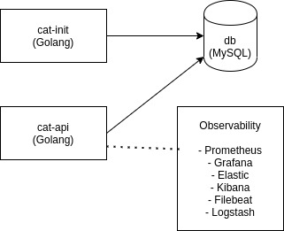
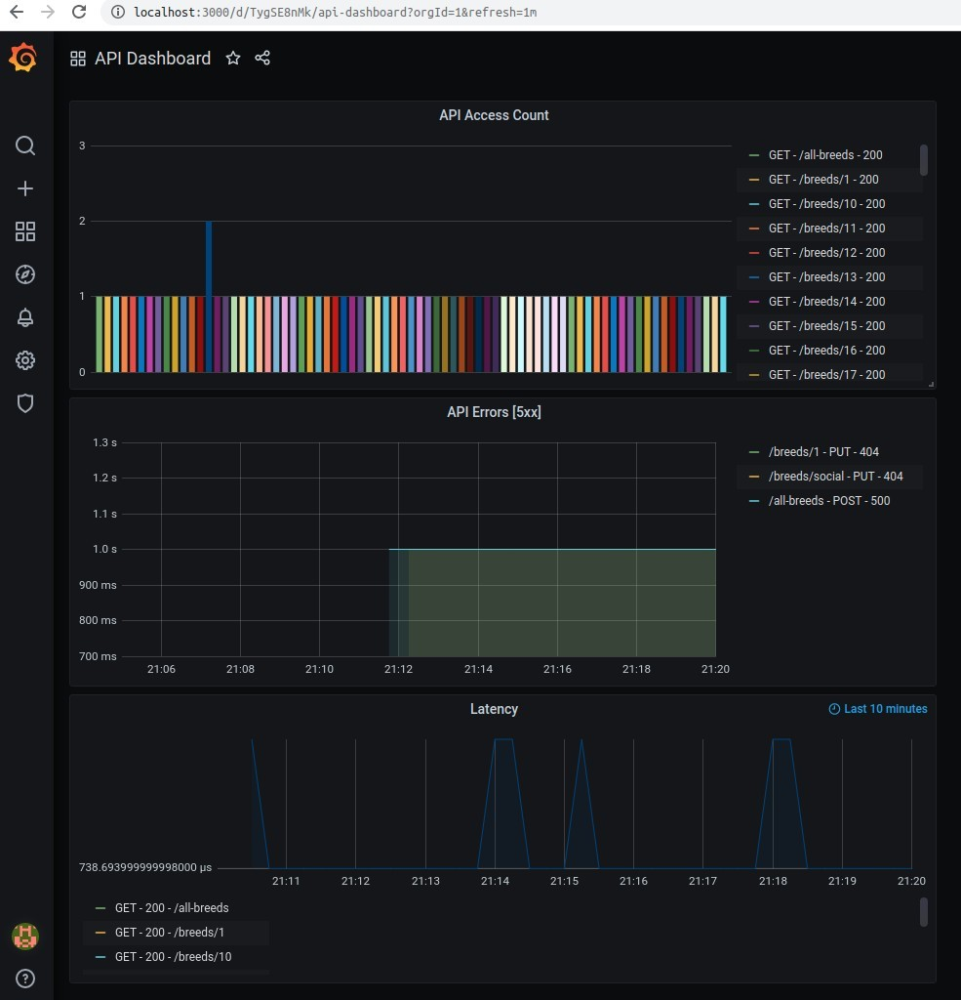
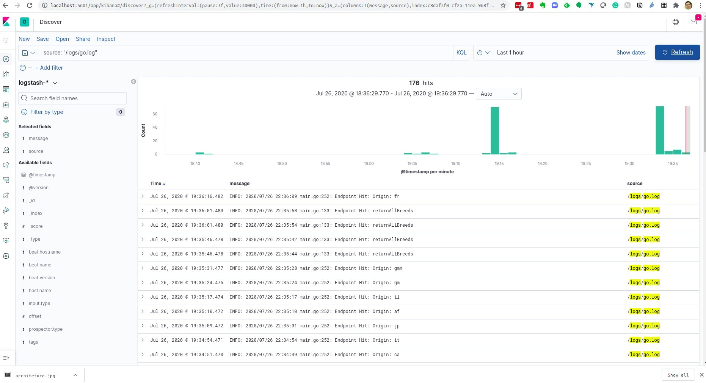

# Go(lang) Simple App - Cat API

A simple API that allows for demonstration of a CRUD model.

- cat-app  
Fetch the data from [The Cat Api](http://thecatapi.com) to populate the database.

- cat-api 
Provides easy access to cat breeds and related information pertaining to the breeds. Each breed has the breeds attributes: origin, common name, characteristics, an image, fun facts, variations and a brief history of the breed.
(the API is a RESTful API, the return format for all endpoints is JSON)

## Running and developing
### Requirements
  - Docker and Docker Compose
  - Golang

### Running the server
1. Clone the repo
2. Run docker-compose to start
```
docker-compose up -d --build
```
Stack starting up:  
```sh
Creating prometheus                    ... done
Creating go-simple-app_elasticsearch_1 ... done
Creating go-simple-app_db_1            ... done
Creating go-simple-app_kibana_1        ... done
Creating go-simple-app_logstash_1      ... done
Creating go-simple-app_filebeat_1      ... done
Creating go-simple-app_cat-init_1      ... done
Creating go-simple-app_cat-api_1       ... done
Creating grafana                       ... done
```  

The server will run on `http://localhost:10000` by default.

## Breeds Model

```yaml
Breeds = {
  ID: AutoID,
  name: String,
  origin: String,
  country_code: String,
  temperament: String,
  description String,
  image: String
}
```
Example:
```
{
  "id": "20",
  "description": "The Chartreux is generally silent but communicative. Short play sessions, mixed with naps and meals are their perfect day. Whilst appreciating any attention you give them, they are not demanding, content instead to follow you around devotedly, sleep on your bed and snuggle with you if you’re not feeling well.",
  "origin": "France",
  "temperament": "Affectionate, Loyal, Intelligent, Social, Lively, Playful"
}
```
## Routes
### List all
 - GET /all-breeds

Returns all breeds.

### Get info about a breed
 - GET /breeds/:id

Returns the info about the single breed.

### Fetch the breeds from temperament
 - GET /breeds/temperament/:temperament

Returns a name list of breeds from temperament.

### Fetch the breeds from origin
 - GET /breeds/origin/:country_code

Returns a name list of breeds from origin.

### Architeture



- db        (MySQL)
- cat-init  (Golang)
- cat-api   (Golang)
- elasticsearch (Observability)
- kibana    (Observability)
- logstash  (Logging)
- filebeat  (Logging)
- prometheus (Monitoring)
- grafana   (Observability)

### Application

```sh
$ go-simple-app
.
├── cmd
├── configs
├── deployments
├── docker-compose.yml
├── go.mod
├── go.sum
├── lib
├── logs
├── pkg
├── README.md
├── sql-scripts
├── src
└── vendor
```

```sh
.
├── cmd
│   └── app
│       ├── cats
│       └── cats.go
├── configs
├── deployments
│   ├── Dockerfile
│   ├── elk
│   │   └── config
│   ├── grafana
│   │   ├── config.ini
│   │   ├── dashboards
│   │   └── provisioning
│   ├── postman
│   │   └── willianccs-cat-api.postman_collection.json
│   ├── prometheus
│   │   └── prometheus.yml
│   └── sql-scripts
│       └── setup.sql
├── docker-compose.yml
├── go.mod
├── go.sum
├── lib
│   └── utils
│       ├── getenv
│       └── mysql
├── logs
├── pkg
│   ├── cmd
│   │   └── app
│   └── main.go
├── README.md
├── sql-scripts
├── src
│   └── github.com
│       └── go-sql-driver
└── vendor
    ├── github.com
    │   ├── beorn7
    │   ├── cespare
    │   ├── golang
    │   ├── gorilla
    │   ├── go-sql-driver
    │   ├── jinzhu
    │   ├── konsorten
    │   ├── mailru
    │   ├── matttproud
    │   ├── olivere
    │   ├── pkg
    │   ├── prometheus
    │   └── sirupsen
    ├── golang.org
    │   └── x
    ├── google.golang.org
    │   └── protobuf
    ├── gopkg.in
    │   └── sohlich
    └── modules.txt
```

### Database structure

```
mysql> show tables;
+----------------+
| Tables_in_cats |
+----------------+
| breeds         |
| breeds_images  |
| cats_glasses   |
| cats_hat       |
+----------------+
4 rows in set (0.01 sec)

mysql> show columns from breeds;
+-------------+---------------+------+-----+---------+----------------+
| Field       | Type          | Null | Key | Default | Extra          |
+-------------+---------------+------+-----+---------+----------------+
| id          | mediumint     | NO   | PRI | NULL    | auto_increment |
| name        | varchar(100)  | YES  |     | NULL    |                |
| origin      | varchar(50)   | YES  |     | NULL    |                |
| country_code| varchar(4)    | YES  |     | NULL    |                |
| temperament | varchar(100)  | YES  |     | NULL    |                |
| description | varchar(1000) | YES  |     | NULL    |                |
+-------------+---------------+------+-----+---------+----------------+
6 rows in set (0.00 sec)

mysql> show columns from breeds_images;
+-------+--------------+------+-----+---------+-------+
| Field | Type         | Null | Key | Default | Extra |
+-------+--------------+------+-----+---------+-------+
| id    | varchar(10)  | YES  |     | NULL    |       |
| img   | varchar(100) | YES  |     | NULL    |       |
+-------+--------------+------+-----+---------+-------+
2 rows in set (0.01 sec)

mysql> show columns from cats_glasses;
+-------+--------------+------+-----+---------+-------+
| Field | Type         | Null | Key | Default | Extra |
+-------+--------------+------+-----+---------+-------+
| id    | varchar(10)  | YES  |     | NULL    |       |
| img   | varchar(100) | YES  |     | NULL    |       |
+-------+--------------+------+-----+---------+-------+
2 rows in set (0.00 sec)

mysql> show columns from cats_hat;
+-------+--------------+------+-----+---------+-------+
| Field | Type         | Null | Key | Default | Extra |
+-------+--------------+------+-----+---------+-------+
| id    | varchar(10)  | YES  |     | NULL    |       |
| img   | varchar(100) | YES  |     | NULL    |       |
+-------+--------------+------+-----+---------+-------+
2 rows in set (0.00 sec)
---------+

mysql> select * from breeds_images;
```

## Observability images

- Grafana
```
URL: http://localhost:3000
User: admin
Pass: admin
```



- Metrics
```
URL: http://localhost:10000/metrics
Prometheus: http://localhost:9090
```

- ELK
```
Elasticsearch: http://localhost:9200
Kibana: http://localhost:5601
Logstash + Filebeat
```
